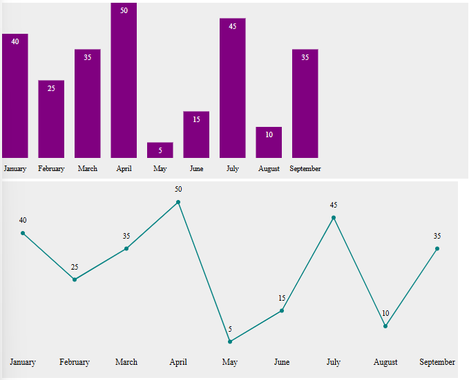

# Dokumentation för ChartLibrary

Denna dokumentation beskriver hur du använder klasserna `BarChart` och `LineChart` för att generera stapel- och linjediagram med hjälp av SVG. Vi går igenom koden och visar exempel på hur klasserna kan användas.


## Innehåll
1. [BarChart.js - Förklaring och användning](#barchart)
2. [LineChart.js - Förklaring och användning](#linechart)
3. [ChartLibrary - Exempel på användning](#chartlibrary)
4. [Installationsanvisningar](#installation)

<a name="barchart"></a>
## BarChart.js - Förklaring och användning

I `BarChart.js` skapas stapeldiagram med SVG där varje stapel representerar ett datapunkt (label, value).

### Viktiga funktioner i BarChart:
- **`createElementNS`**: Används för att skapa SVG-element i rätt namnrymd (namespace), vilket är nödvändigt för att kunna använda SVG i HTML-dokument.
- **Placering av staplar**: Staplarnas position beräknas baserat på deras index i datamängden och deras värde. `x`- och `y`-attributen styr placeringen i diagrammet.
- **Textetiketter**: Etiketter visas under varje stapel genom `<text>`-element, och med hjälp av `text-anchor: middle` placeras texten centrerad under stapeln.

### Exempel på användning:

```javascript
const data = [
    {"label": "January", "value": 40},
    {"label": "February", "value": 25},
    {"label": "March", "value": 35}
]

const chart = new BarChart(data)
document.body.innerHTML = chart.render()
```


*Resultat från ovanstående kod*

<a name="linechart"></a>
## LineChart.js - Förklaring och användning
I LineChart.js skapas linjediagram där datapunkterna kopplas samman med en linje. Varje punkt markeras med en cirkel och en etikett.

### Viktiga funktioner i LineChart:
- *`Polyline`*: Ett <polyline>-element används för att skapa linjen som kopplar samman datapunkterna. En sträng med koordinater (x, y) skickas till polyline för att rita linjen.
- *`Cirklar vid punkterna`*: Varje datapunkt markeras med en liten cirkel för att tydligt visa var punkterna är placerade.
- *`Textetiketter`*: Textetiketter placeras under varje datapunkt, precis som i stapeldiagrammet, för att visa vilken label som hör till varje punkt.

### Exempel på användning:
```javascript
const data = [
    {"label": "January", "value": 40},
    {"label": "February", "value": 25},
    {"label": "March", "value": 35}
]

const chart = new LineChart(data)
document.body.innerHTML = chart.render()
```
I detta exempel skapas ett linjediagram som kopplar samman datapunkterna med en linje.


*Resultat från ovanstående kod*

<a name="chartlibrary"></a>

## ChartLibrary - Exempel på användning
ChartLibrary är en klass som förenklar genereringen av både stapel- och linjediagram. Den hanterar skapandet av diagram baserat på vilken typ du vill visa.

### Exempel på att generera diagram med ChartLibrary:
```javascript
import { ChartLibrary } from '../src/ChartLibrary.js'

const data = [
    { label: "January", value: 40 },
    { label: "February", value: 25 },
    { label: "March", value: 35 },
    { label: "April", value: 50 },
    { label: "May", value: 5 },
    { label: "June", value: 15 },
    { label: "July", value: 45 },
    { label: "August", value: 10 },
    { label: "September", value: 35 }
]

const charts = new ChartLibrary()

// Generera stapeldiagram
const barChart = charts.createBarChart(data)
const chartContainer = document.createElement('div')
chartContainer.innerHTML = barChart
document.body.appendChild(chartContainer)

// Generera linjediagram
const lineChart = charts.createLineChart(data)
const lineChartContainer = document.createElement('div')
lineChartContainer.innerHTML = lineChart
document.body.appendChild(lineChartContainer)
```
I detta exempel används ChartLibrary för att generera och rendera både ett stapel- och linjediagram baserat på samma datamängd.



*Resultat från ovanstående kod*

-------------------------------

<a name="installation"></a>
## Installationsanvisningar

1. **Klona detta repository:**

```bash
git clone <repository-url>
cd <repository-folder>
```

2. **Installera en lokal server (om du inte redan har en):**

- Om du använder Node.js, intallera exempelvis `vite` eller `http-server`:

```bash
npm install vite
```

3. **Kör den lokala servern:**

```bash
vite
```

Detta gör att du kan testa och visa dina SVG-diagram i webbläsaren.

4. **Inkludera JavaScript-filerna i ditt projekt:**

- Lägg till följande script-taggar i din HTML-fil:

```html
<script type="module" src="./BarChart.js"></script>
<script type="module" src="./LineChart.js"></script>
<script type="module" src="./ChartLibrary.js"></script>
```

5. Använd biblioteksmetoderna för att skapa diagram:

```javascript
import { ChartLibrary } from './ChartLibrary.js'

const chartLib = new ChartLibrary()
const barChart = chartLib.createBarChart([{ label: 'Jan', value: 30 }, { label: 'Feb', value: 20 }])
document.getElementById('chart-container').innerHTML = barChart
```

## Ytterligare förbättringar:
PieChart: En funktion för att skapa cirkeldiagram (PieChart) är under utveckling och kommer att läggas till i framtiden.