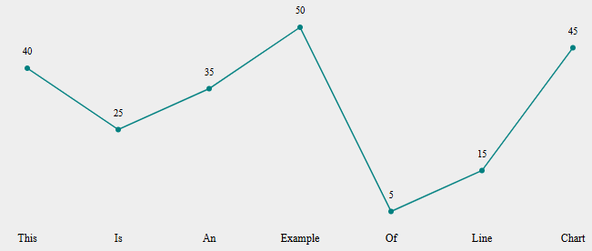

# Clean Code Analysis

## Chapter 2: Meaningful Names

Thething that I found fixable the most from the chapter was 'Use Intention-Revealing Names'. There were a couple instances where even I upon coming back to the code had trouble figuring out exactly what they did because I was not clear enough. Here are two examples:

I changes the name of the variable `svg` to `svgElement` to make it clearer that the variable represented an element. It could be easy to think "svg" was short for something without the context.

I changed the name from `time` to `elapsedTimeInSeconds` here. Time doesn't say much about what it is and even less when it is a parameter for a method. 

## Chapter 3: Functions

I feel like my functions were okay according to the book. Fairly short with descriptive names, and they mostly only do one thing. Though one thing I can find, that might make my code better quality is what the book calls `Argument Objects`. For example in instances like this:

As for now I haven't changed it, but that is a possible improvment of the code.

## Chapter 4: Comments

I feel like my comments are mostly good. Examples from book:

### TODO Comments

I could find a couple of "Bad Comments" tthough, that I removed. Example:

*These comments does not explain anything that the names of the methods does not*

Also found a bit of noise comments here and there:

## Chapter 5: Formatting

## Chapter 6: Objects and Data Structures